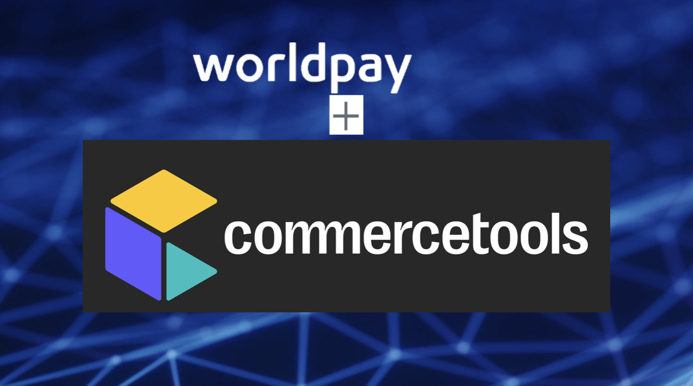
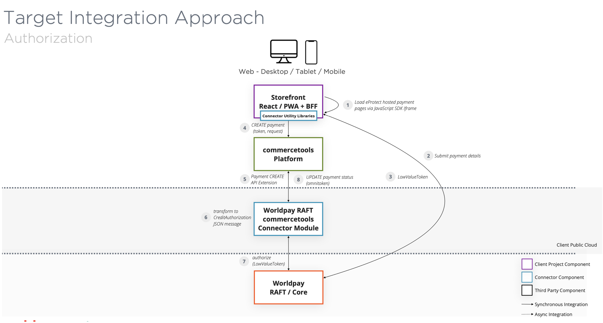

The worldpay-RAFT-commercetools-connector module provides integration between commercetools and the Worldpay Native RAFT API, to minimize implementation timescales, and client-side configuration required. It supports the following use cases:

* Payment Authorization through the creditAuth API using eProtect for the following payment methods:
    * Credit Card
    * Google Pay
    * Apple Pay
    * PINLess Debit
* Payment Cancellations (part and full) through the creditAuth API specifying reversal attributes.
* Payment Completions (part and full) through the creditCompletion API.
* Refunds (part and full) through the creditRefund API.
* Gift Card Transactions through the Gift Card API:
    * Gift Card Inquiry	
    * Gift Card Pre Authorization
    * Gift Card Pre Authorization Reversal
    * Gift Card Completion
    * Gift Card Refund

In addition to the above use cases, the module source code repository provides:

* Infrastructure-as-code (IaC) cloud deployment templates for easy provisioning into a client’s cloud infrastructure.
* A suite of unit and integration test components.

#### Integration Approach

The integration approach leverages commercetools API Extensions to transform payment create / update API calls via the Worldpay RAFT Connector module between commercetools and Worldpay RAFT.

The below diagram shows an overview of the steps within the journey to create / update a payment, whilst utilizing eProtect to reduce PCI liability. This will form the backbone of the infrastructure covered within this document.

For full details of the connector:

* [User Guide](https://github.com/Worldpay/Worldpay-CommerceTools-RAFT/blob/main/resources/docs/Worldpay%20RAFT%20User%20Guide.pdf)
* [Technical Guide](./resources/docs/TechnicalDocumentation.md)
* [Deployment Guide](./resources/docs/DeploymentGuide.md)

#### Extensibility

The connector is designed to be flexible and easy to customize. It consists of Node.js applications that can be provisioned in your chosen public cloud, for example as serverless functions in AWS or Azure, or on any system using Docker containers.

* [Technical Guide](./resources/docs/TechnicalDocumentation.md)

#### Compatibility

The connector is designed to work with the following components:

* [RAFT version 1.22](https://developerengine.fisglobal.com/apis/native-raft)
* [eProtect v4](https://developerengine.fisglobal.com/apis/usecomm/eprotect)
* The [commercetools API](https://docs.commercetools.com/docs/), which is not versioned and future releases are always backwards compatible

